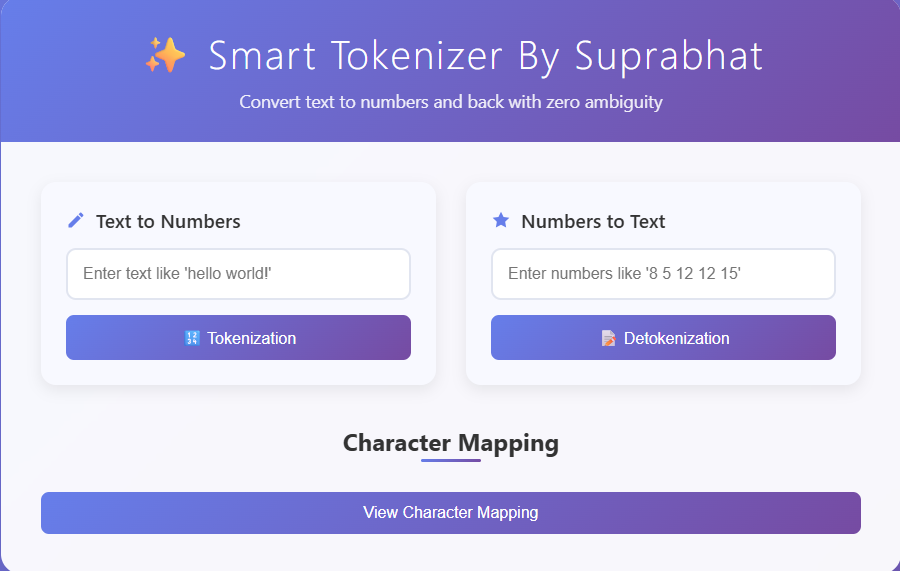
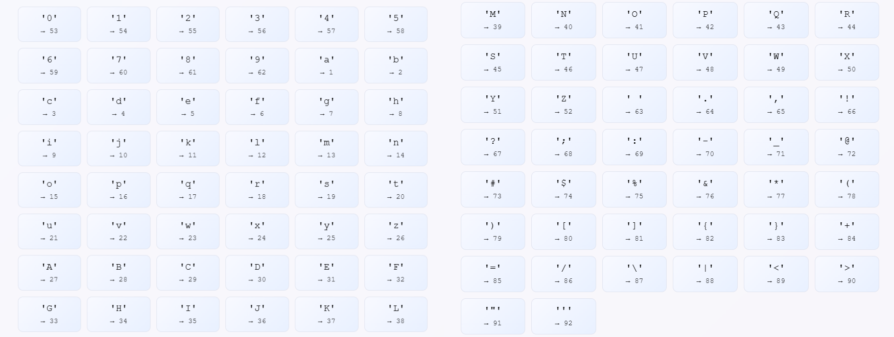

# ✨ Smart Tokenizer

A beautiful, character tokenizer that converts text to space-separated numbers and back. Built with modern web technologies and a sleek gradient UI.

  

## 🚀 Features

- **Zero Ambiguity**: Uses space-separated tokens to avoid confusion (e.g., "hi" → "8 9", not "89")
- **Complete Character Set**: Supports lowercase, uppercase, numbers, and special characters
- **Beautiful UI**: Modern glassmorphism design with smooth animations
- **Interactive Mapping**: Toggleable character-to-number reference table
- **Real-time Conversion**: Instant encoding/decoding with verification
- **Mobile Responsive**: Works perfectly on all device sizes

## 🎯 How It Works

### Character Mapping
- **Lowercase letters**: `a=1, b=2, ..., z=26`
- **Uppercase letters**: `A=27, B=28, ..., Z=52`
- **Numbers**: `0=53, 1=54, ..., 9=62`
- **Special characters**: Space, punctuation, symbols (63+)

### Examples
```
Input: "hello"
Output: "8 5 12 12 15"

Input: "8 5 12 12 15"
Output: "hello"

Input: "Hi!"
Output: "35 9 33"
```

## 🛠️ Installation & Usage

### Quick Start
1. Clone the repository:
```bash
git clone https://github.com/Suprabhat3/tokenizer.git
```

2. Navigate to the project directory:
```bash
cd tokenizer
```

3. Open `index.html` in your web browser or serve with a local server:
```bash


### Using the Tokenizer Class

```javascript
// Initialize tokenizer
const tokenizer = new SimpleTokenizer();

// Encode text to space-separated numbers
const encoded = tokenizer.encode("hello world");
console.log(encoded); // "8 5 12 12 15 32 23 15 18 12 4"

// Decode numbers back to text
const decoded = tokenizer.decode("8 5 12 12 15");
console.log(decoded); // "hello"

// Get character mapping
const mapping = tokenizer.getMapping();
console.log(mapping['a']); // 1
```

## 🎨 UI Features

- **Gradient Background**: Beautiful purple gradient with glassmorphism effects
- **Interactive Cards**: Hover animations and smooth transitions
- **Toggle Mapping**: Show/hide character reference table with animations
- **Real-time Feedback**: Instant results with verification
- **Icons & Emojis**: Visual indicators for better UX

## 📱 Screenshots

### Main Interface


### Character Mapping


## 🔧 Technical Details

### Core Components
- **SimpleTokenizer Class**: Main tokenization logic
- **HTML Interface**: Modern responsive design
- **CSS Animations**: Smooth transitions and effects
- **JavaScript Functions**: Interactive UI controls

### File Structure
```
tokenizer/
├── index.html          # Main application file
├── style.css           # Main application file
├── script.js           # Main application file
├── README.md           # This file
└── assets/             # (UI screenshot) Additional resources
```

## 🌟 Why This Tokenizer?

### Problem Solved
Traditional concatenated tokenizers can be ambiguous:
- "hi" could be parsed as "89" (h=8, i=9) 
- But what if there's a character mapped to 89?

### Our Solution
Space-separated tokens eliminate ambiguity:
- "hi" → "8 9" (clearly two separate tokens)
- "8 9" → "hi" (unambiguous decoding)

## 🤝 Contributing

1. Fork the repository
2. Create your feature branch (`git checkout -b feature/AmazingFeature`)
3. Commit your changes (`git commit -m 'Add some AmazingFeature'`)
4. Push to the branch (`git push origin feature/AmazingFeature`)
5. Open a Pull Request


## 👨‍💻 Author

**Suprabhat**
- GitHub: [@Suprabhat3](https://github.com/Suprabhat3)
- Repository: [tokenizer](https://github.com/Suprabhat3/tokenizer.git)
- Twitter(X): [Suprabhat3](https://x.com/Suprabhat_3)

## 🙏 Acknowledgments

- Part of the GenAI with JS Cohort by Piyush Garg & Hitesh Choudhary
- Built with modern web technologies
- Designed for simplicity and elegance

## 📊 Usage Statistics

- **Total Characters Supported**: 90+ characters
- **Zero Ambiguity**: 100% reliable encoding/decoding
- **Browser Compatibility**: All modern browsers
- **Mobile Friendly**: Fully responsive design

---

**⭐ Star this repo if you found it helpful!**

Made with ❤️ by [Suprabhat](https://github.com/Suprabhat3)